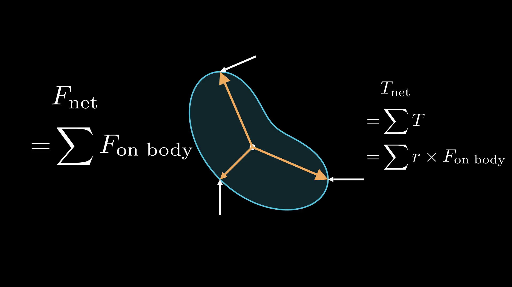

[Youtube video](https://youtu.be/mO_-lGLCmZ4)

## Install manim (community edition) via pip:
`$ pip3 install manim`

## Render a .mp4 animation from a file:
`$ manim -pqh <filename>.py <Class name>`

## Low quality (fast render):
`$ manim -pql <filename>.py <Class name>`

Refer to [manim community docs](https://docs.manim.community/) for more info.
